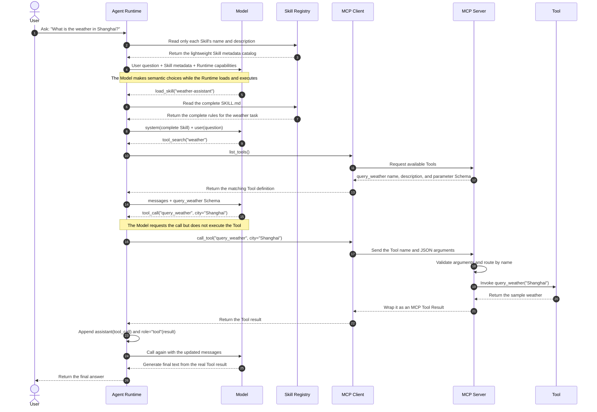

# Agent Engineering Lab

**English** | [简体中文](README.zh-CN.md)

A hands-on lab for understanding and building the real Model–Runtime–Skill–MCP–Tool loop.

The foundational exercises answer one question:

> **After a user asks a question, how does the Model select a Skill and Tool, and how does the Agent Runtime load, execute, and loop over those decisions?**

The foundation still requires edits to only **three files**, takes about 30 minutes, and needs no API key. The advanced exercise shows how an editor and GitHub Copilot can load the same kind of Agent directly; that part requires signing in to GitHub Copilot and installing Copilot CLI for the plugin workflow.

| Exercise | Goal | Hands-on work |
|---|---|---|
| 1. Tool | Write the code that performs the real work | Complete one line |
| 2. MCP | Make the Tool discoverable and callable | Add one decorator |
| 3. Skill | Write reusable task instructions | Write eight lines of Markdown |
| 4. Agent Runtime | Execute Model-selected actions and maintain the loop | Complete five code sections |
| 5. Editor and plugin | Let Copilot load the Agent directly | Configure a project Agent and install the example plugin |

### Complete execution flow, starting with the user



The diagram separates the **Agent system** into `Agent Runtime + Model`. This distinction is essential for understanding real Agent execution. On every call, the Model may return final text or select another action; the diagram expands the complete path that needs both a Skill and a Tool.

Keep these five boundaries in mind:

1. **The Model selects**: it uses the question and metadata to decide which Skill to load, which Tool to search for, and whether to emit a `tool_call`.
2. **The Agent Runtime executes and constrains**: it maintains messages, loads files, calls the Model, performs actions, checks permissions, and controls the loop.
3. **A Skill is a set of rules**: normally only its name and description are exposed initially; the full body is loaded after selection.
4. **MCP handles discovery, transport, and routing**: the Tool contains the actual business logic.
5. **A Tool Result is a new observation**: the Runtime must return it to the Model as `role="tool"` rather than writing the final answer itself.

Implementations differ across Agent products. A small Tool set might be sent to the Model all at once, while another client may pre-filter candidates first. This exercise prints `load_skill` and `tool_search` explicitly so normally hidden Copilot Runtime actions are observable.

## Setup: install the dependency

**Goal:** Install only the MCP SDK.

Run from the repository root:

```powershell
py -3.11 -m venv .venv
.\.venv\Scripts\python.exe -m pip install -r requirements.txt
```

If downloading is slow:

```powershell
.\.venv\Scripts\python.exe -m pip install -i https://pypi.tuna.tsinghua.edu.cn/simple -r requirements.txt
```

---

## Exercise 1: write a Tool

**Goal:** Understand that a Tool starts as an ordinary function that performs deterministic work. It does not depend on a Model, Agent, or MCP.

**File:** `practice\tool_mcp.py`

**Task:**

Find `TODO 1`, remove `raise NotImplementedError(...)`, and replace it with:

```python
return f"{city}：晴，25°C"
```

**Run:**

```powershell
.\.venv\Scripts\python.exe practice\tool_mcp.py tool
```

**Expected result:**

```text
上海：晴，25°C
```

**What you must understand:**

> A Tool is the code that performs the real work. A Model cannot execute it merely because it knows the function name.

---

## Exercise 2: expose the Tool through MCP

**Goal:** Understand that MCP is not a Tool. It is the protocol that lets external programs discover and call Tools consistently.

**File:** Still `practice\tool_mcp.py`.

**Task:**

Add this line above `query_weather`:

```python
@mcp.tool()
```

The completed function should be:

```python
@mcp.tool()
def query_weather(city: str) -> str:
    """Return the weather for a city."""
    return get_weather(city)
```

**Run:**

```powershell
.\.venv\Scripts\python.exe practice\tool_mcp.py mcp
```

**Expected result:**

The output should contain:

```text
"name": "query_weather"
"description": "Return the weather for a city."
"city"
MCP 返回： {"result": "上海：晴，25°C"}
```

**Observe:**

- MCP derives the Tool name from the function name.
- MCP derives the Tool description from the docstring.
- MCP generates the argument JSON Schema from `city: str`.
- The MCP Client calls the Tool by name and JSON arguments without knowing its implementation.

**What you must understand:**

> A Tool is a capability; MCP is a standard way to publish, discover, and call that capability.

---

## Exercise 3: write a Skill

**Goal:** Understand that a Skill is reusable text for the Model, not executable code. `name` and `description` support discovery; the body is loaded only after selection.

**File:** `practice\SKILL.md`

**Task:**

Replace the file with:

```markdown
---
name: weather-assistant
description: 回答天气问题。用户询问某个城市天气时使用。
---

# Weather Assistant

1. 从用户问题中识别城市。
2. 必须调用 `query_weather`，不能猜测天气。
3. 根据 Tool 返回值，用一句中文回答。
```

The deterministic demo uses this Chinese metadata and question so its selection behavior stays easy to inspect.

**Check:**

```powershell
Get-Content practice\SKILL.md
```

The file should no longer contain `TODO`.

**What you must understand:**

> At startup, the Runtime only needs the Skill metadata. After the Model selects it from `description`, the Runtime loads the complete body. These are the first two layers of Skill progressive disclosure.

---

## Exercise 4: write a realistic Agent Runtime loop

**Goal:** Understand the core Agent loop: **Model selects the next action → Runtime executes the action → the observation goes back to the Model**.

**File:** `practice\agent.py`

`demo_model` is a deterministic Model substitute. It selects these actions in order:

```text
load_skill → tool_search → tool_call → final text
```

A real client might implement the first two as built-in Tools or an internal protocol. This exercise exposes them deliberately so the Runtime/Model boundary is visible.

Complete five code sections.

### Step 4.1: send the current context to the Model

Find `TODO 4A` and replace:

```python
reply: dict = {}
```

with:

```python
reply = await demo_model(messages, available_skills, model_tools)
```

The first request contains only the user question and Skill metadata. It has not loaded the complete Skill or any business Tool.

### Step 4.2: load the complete Skill selected by the Model

Find `TODO 4B` and replace:

```python
skill = ""
```

with:

```python
skill = load_skill(skill_path, skill_name)
```

The Runtime executes `load_skill`; the Model decides which Skill to load.

### Step 4.3: discover an MCP Tool from the Model's search query

Find `TODO 4C` and replace:

```python
model_tools = []
```

with:

```python
model_tools = await search_mcp_tools(client, query)
```

Only now does the complete `query_weather` parameter Schema enter the Model context.

### Step 4.4: execute the Tool Call emitted by the Model

Find `TODO 4D` and replace:

```python
result = None
```

with:

```python
result = await client.call_tool(call["name"], call["arguments"])
```

### Step 4.5: return the Tool Result as an observation

Remove the `raise NotImplementedError(...)` below `TODO 4E` and replace it with:

```python
messages.append(
    {
        "role": "tool",
        "name": call["name"],
        "content": json.dumps(
            result.structured_content,
            ensure_ascii=False,
        ),
    }
)
```

**Run:**

```powershell
.\.venv\Scripts\python.exe practice\agent.py
```

**Expected flow:**

```text
Model call 1: user(question) + Skill metadata; returns load_skill
Agent Runtime: reads the complete SKILL.md
Model call 2: system(complete Skill) + user(question); returns tool_search
Agent Runtime: discovers query_weather on demand through MCP list_tools
Model call 3: messages + query_weather Schema; returns tool_call
Agent Runtime: executes query_weather through MCP call_tool
Model call 4: adds assistant(tool_call) + tool(result); returns final text
```

The final output should contain:

```text
[最终答案]
Model 根据 Tool 结果回答：上海：晴，25°C
```

**What you must understand:**

> The Model performs semantic reasoning and selects the next action. The Agent Runtime does not replace that reasoning; it loads, discovers, executes, enforces permissions, records observations, and continues the loop.

### Minimal structure of a real Agent

| Module | This exercise | What a real integration replaces or extends |
|---|---|---|
| Skill Registry | `read_skill_metadata`, `load_skill` | Scan project, user, or plugin Skills |
| Model Adapter | `demo_model` | Call a real model API and normalize responses into Runtime actions |
| Tool Registry | `search_mcp_tools` | Aggregate Tool Schemas from MCP, local functions, and remote APIs |
| Runtime Loop | `run_agent` | Add permission prompts, timeouts, retries, maximum rounds, and cancellation |
| Session State | `messages` | Add persistence, summarization, context trimming, and tracing |

When integrating a real model, the core loop structure remains the same: the Model Adapter receives `messages + Skill metadata + tools` and converts model responses into final text, Runtime actions, or standard `tool_call` values.

---

## Advanced exercise 5: let Copilot use the Agent directly

**Goal:** Understand two distribution methods:

1. **Project-level Agent**: commit an `.agent.md` file so editors can use it when the repository is open.
2. **Agent Plugin**: package the Agent, Skill, and MCP Server as an installable directory that Copilot CLI and VS Code can use across projects.

These are alternative deployment methods and do not have to be configured together. A project Agent is suitable for repository-specific sharing; a Plugin is suitable for reuse and distribution.

### 5.1 Configure a project Agent in an editor

This repository includes:

```text
.github\agents\weather-workspace.agent.md
.vscode\mcp.json
```

`.github\agents\*.agent.md` is the shared project-level Agent location for VS Code and JetBrains. The important frontmatter is:

```yaml
---
name: weather-workspace
description: 使用本仓库的天气 MCP 工具回答城市天气；当用户询问天气、气温或天气状况时使用。
tools:
  - weather-workspace/query_weather
user-invocable: true
disable-model-invocation: false
---
```

| Field | Purpose |
|---|---|
| `description` | Explains what the Agent does and when to use it; this is the primary signal for implicit invocation |
| `tools` | Tool allowlist for the Agent; permission does not guarantee invocation |
| `user-invocable` | Whether users can select it manually, default `true` |
| `disable-model-invocation` | Whether automatic Model delegation is disabled, default `false` |

In VS Code, run:

```powershell
.\.venv\Scripts\python.exe -m pip install -r requirements.txt
code .
```

Open Copilot Chat, select `weather-workspace` from the **Agent picker**, and enter:

```text
上海天气怎么样？
```

`.vscode\mcp.json` starts the repository's stdio MCP Server. On the first call, approve the server startup and Tool permissions when prompted.

In JetBrains, open Copilot Chat and select **Configure Agents... → Workspace** from the Agent menu. The Agent under `.github\agents` appears there. JetBrains does not read `.vscode\mcp.json`, so register the same Python command separately in its MCP settings. Custom Agents may still be marked Preview in JetBrains.

> Selecting an Agent does not execute a Tool. The Copilot Runtime exposes Skill metadata and Tool capabilities to the Model; the Model selects an action; the Runtime then loads a Skill, discovers a Tool, or executes an MCP Tool.

### 5.2 Package the Agent as a Copilot Plugin

The complete Agent Plugins 1.0 example is located at:

```text
plugins\weather-assistant\
├── plugin.json
├── mcp.json
├── servers\
│   └── weather_mcp.py
├── skills\
│   └── weather-assistant\
│       └── SKILL.md
└── com.github.copilot\
    └── agents\
        └── weather-assistant.agent.md
```

| File | How Copilot uses it |
|---|---|
| `plugin.json` | Declares the plugin name, version, and Agent Plugins specification |
| `mcp.json` | Registers a stdio MCP Server named `weather` |
| `servers\weather_mcp.py` | Implements `query_weather`; this completed example does not depend on the foundational TODOs |
| `skills\...\SKILL.md` | Provides a weather Skill for implicit discovery or explicit invocation |
| `com.github.copilot\agents\...agent.md` | Provides a custom Agent that can be selected or delegated to |

Agent Plugins 1.0 discovers components from fixed locations: portable Skills belong under `skills\`, MCP configuration belongs in root `mcp.json`, and Copilot-specific Agents belong under `com.github.copilot\agents\`. Do not mix legacy CLI manifest fields such as top-level `agents`, `skills`, or `mcpServers` paths into this `plugin.json`.

Install [GitHub Copilot CLI](https://docs.github.com/en/copilot/how-tos/copilot-cli/set-up-copilot-cli/install-copilot-cli) before running the plugin commands. On Windows, Copilot CLI requires PowerShell 6 or later:

```powershell
winget install --id Microsoft.PowerShell --source winget
winget install GitHub.Copilot
```

Open PowerShell 7 with `pwsh`, then verify:

```powershell
copilot --version
```

Install the Python dependency first and make sure `python` in the Copilot environment resolves to that virtual environment:

```powershell
.\.venv\Scripts\Activate.ps1
python -m pip install -r requirements.txt

copilot plugin install .\plugins\weather-assistant
copilot plugin list
copilot mcp get weather
```

For interactive use, run `copilot`, enter `/agent`, and select `weather-assistant`. Or run:

```powershell
copilot --agent weather-assistant `
  --prompt "上海天气怎么样？" `
  --allow-tool='weather(query_weather)'
```

`--allow-tool` pre-approves Tool permission; it does not force the Model to invoke that Tool. The plugin's `mcp.json` uses `command: "python"`, and plugin installation does not install Python dependencies. Run Copilot CLI from the activated environment above. When VS Code uses the plugin MCP, its `python` environment must also contain `mcp>=2,<3`; the project configuration in 5.1 directly uses this repository's virtual environment interpreter.

Installed plugins are copied to `%USERPROFILE%\.copilot\installed-plugins\`. Re-run `copilot plugin install` after changing the source. VS Code can discover plugins from the Copilot CLI installation cache; run **Developer: Reload Window** if necessary. JetBrains does not currently document equivalent plugin-cache behavior, so prefer the project-level Agent method in 5.1 there.

This example requires a Copilot CLI version that supports Agent Plugins 1.0 (at least 1.0.74) and a recent VS Code release. Business or Enterprise organizations must also allow **MCP servers in Copilot**.

### 5.3 Explicit invocation, implicit invocation, and progressive disclosure

| Concept | Who decides | Example |
|---|---|---|
| **Explicit invocation** | The user names an Agent, Skill, or Tool | Select `weather-assistant`, use `--agent`, enter `/weather-assistant:weather-assistant`, or attach the weather Tool with `#` |
| **Implicit invocation** | The Model chooses from names, `description`, the current task, and available Tools | Ask only about weather; the Model delegates to the weather Agent, loads the weather Skill, or calls `query_weather` |
| **Progressive disclosure** | The client loads context in layers on demand | Read only Skill names and descriptions at startup, then full `SKILL.md`, then `references\`, `scripts\`, or `assets\` only when needed |

Do not conflate them:

- Explicit versus implicit invocation answers **who selects the capability**.
- Progressive disclosure answers **when and how much content enters context**. It saves context; it does not execute a capability.
- Agent Skills formally define three progressive-disclosure layers. A Custom Agent is mainly loaded through selection or delegation and should not be described with the same three-layer definition.
- MCP Tool Search can also defer Tool-definition loading, but loading a Tool definition is still not executing the Tool.

Two frontmatter fields control Agent invocation:

| Configuration | Explicit user invocation | Implicit Model invocation |
|---|---:|---:|
| Both fields omitted | Yes | Yes |
| `user-invocable: false` | No | Yes |
| `disable-model-invocation: true` | Yes | No |
| Both fields set | No | No |

Plugin descriptions deliberately state both what the component does and when to use it because implicit invocation relies heavily on description matching. Before installing an external Plugin, inspect its MCP programs and Hooks; they execute with the local user's permissions.

**Official references:**

- [GitHub Copilot custom agents configuration](https://docs.github.com/en/copilot/reference/custom-agents-configuration)
- [VS Code Custom Agents](https://code.visualstudio.com/docs/agent-customization/custom-agents)
- [VS Code Agent Plugins](https://code.visualstudio.com/docs/agent-customization/agent-plugins)
- [Agent Plugins 1.0 Specification](https://agent-plugins.org/specification)
- [GitHub Copilot CLI plugins](https://docs.github.com/en/copilot/how-tos/copilot-cli/customize-copilot/plugins-creating)
- [Progressive disclosure in Agent Skills](https://agentskills.io/specification#progressive-disclosure)

---

## Restate the system in eight sentences

After finishing, answer without looking at the code:

1. **Model**: selects final text, a Runtime action, or a `tool_call` from the current context.
2. **Agent Runtime**: maintains messages and the loop, and executes Model-selected actions.
3. **Skill**: tells the Model how to perform a type of task; it is not executable code.
4. **Tool**: a function that performs deterministic work.
5. **MCP**: the protocol that lets the Runtime discover and call Tools consistently.
6. **Explicit invocation**: the user names the Agent, Skill, or Tool.
7. **Implicit invocation**: the Model selects a capability from descriptions and context.
8. **Progressive disclosure**: load minimal metadata first, then complete instructions and resources on demand.

`demo_model` in `practice\agent.py` is deterministic, so no API key is required. It prints normally hidden `load_skill` and `tool_search` decisions explicitly. After replacing it with a real Model Adapter, the Runtime loop, progressive disclosure, MCP, and Tool Result feedback relationships remain the same.
