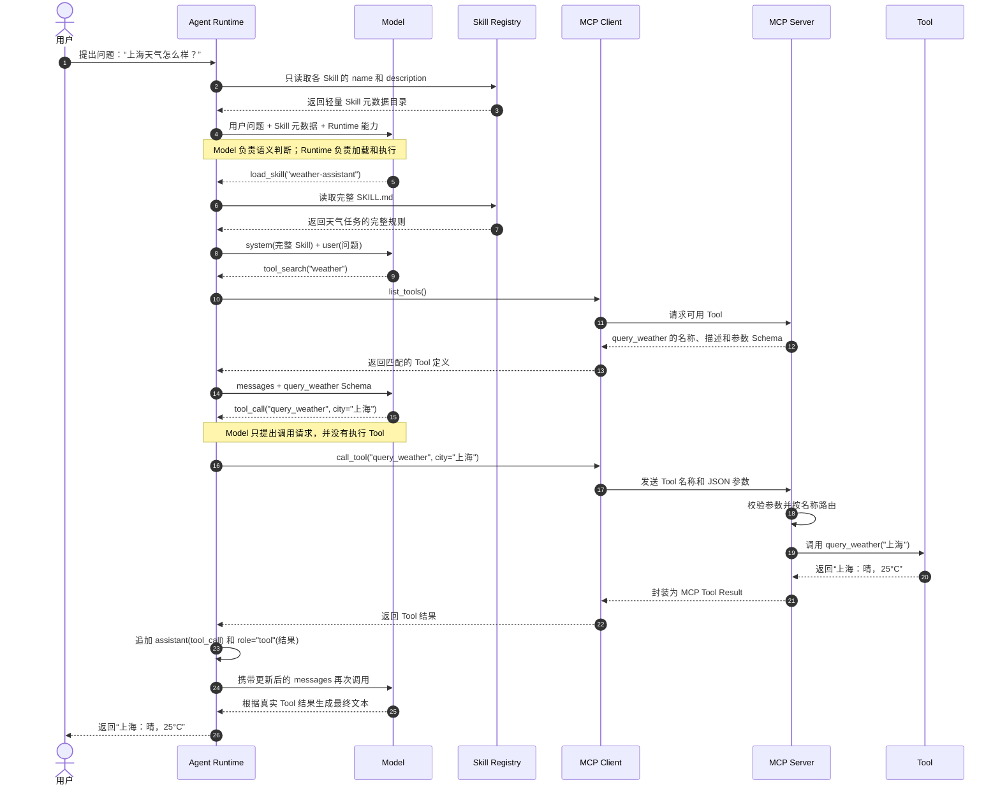

# Agent 最小练习

基础练习只回答一个问题：

> **用户提出问题后，Model 如何选择 Skill 和 Tool，Agent Runtime 又如何加载、执行并形成循环？**

基础部分仍然只改 **3 个文件**，按顺序完成约 30 分钟，不需要 API Key。进阶部分演示如何让编辑器和 GitHub Copilot 直接加载同类 Agent；这部分需要登录 GitHub Copilot。

| 练习 | 目的 | 实际操作 |
|---|---|---|
| 1. Tool | 写出真正执行工作的代码 | 补 1 行 |
| 2. MCP | 让 Tool 可被发现和调用 | 加 1 个装饰器 |
| 3. Skill | 写出可复用的做事规则 | 写 8 行 Markdown |
| 4. Agent Runtime | 执行 Model 选择的动作并维护循环 | 补 5 处代码 |
| 5. 编辑器与插件 | 让 Copilot 直接加载 Agent | 配置项目 Agent，并安装示例插件 |

### 完整调用流程（从用户开始）



图中把 **Agent 系统**拆成了 `Agent Runtime + Model`，这是理解真实运行路线的关键。每次调用 Model，它都可以直接返回最终文本，也可以选择下一步动作；图中展开的是需要 Skill 和 Tool 的完整路径。

按图需要抓住五个边界：

1. **Model 负责选择**：根据问题和元数据决定加载哪个 Skill、搜索哪个 Tool、是否发出 `tool_call`。
2. **Agent Runtime 负责执行和约束**：维护消息、加载文件、调用 Model、执行动作、检查权限并控制循环。
3. **Skill 是规则**：启动时通常只暴露名称和描述，Model 选中后才加载全文。
4. **MCP 负责发现、传输和路由**：Tool 才包含实际业务逻辑。
5. **Tool Result 是新的观察**：Runtime 必须把结果作为 `role="tool"` 再交给 Model，而不是自己编写最终答案。

不同 Agent 产品的具体实现会有差异：工具较少时可能一次性把全部 Schema 交给 Model，也可能先由客户端做候选过滤。本练习把 `load_skill` 和 `tool_search` 显式打印出来，是为了让通常隐藏在 Copilot 内部的 Runtime 动作可以被观察。

## 准备：安装依赖

**目的：** 只安装 MCP SDK。

在项目根目录运行：

```powershell
py -3.11 -m venv .venv
.\.venv\Scripts\python.exe -m pip install -r requirements.txt
```

下载较慢时：

```powershell
.\.venv\Scripts\python.exe -m pip install -i https://pypi.tuna.tsinghua.edu.cn/simple -r requirements.txt
```

---

## 练习 1：写一个 Tool

**目的：** 理解 Tool 首先只是一个执行确定任务的普通函数，与 Model、Agent、MCP 都无关。

**文件：** `practice\tool_mcp.py`

**操作：**

找到 `TODO 1`，删除 `raise NotImplementedError(...)`，改成：

```python
return f"{city}：晴，25°C"
```

**运行：**

```powershell
.\.venv\Scripts\python.exe practice\tool_mcp.py tool
```

**预期结果：**

```text
上海：晴，25°C
```

**完成后必须理解：**

> Tool 是真正执行工作的代码；Model 不能因为“知道函数名”就自动执行它。

---

## 练习 2：把 Tool 暴露给 MCP

**目的：** 理解 MCP 不是 Tool，而是让外部程序统一发现和调用 Tool 的协议。

**文件：** 仍然是 `practice\tool_mcp.py`

**操作：**

在 `query_weather` 函数上方添加一行：

```python
@mcp.tool()
```

完成后应是：

```python
@mcp.tool()
def query_weather(city: str) -> str:
    """查询指定城市的天气。"""
    return get_weather(city)
```

**运行：**

```powershell
.\.venv\Scripts\python.exe practice\tool_mcp.py mcp
```

**预期结果：**

输出中应包含：

```text
"name": "query_weather"
"city"
MCP 返回： {"result":"上海：晴，25°C"}
```

**观察：**

- MCP 根据函数名得到 Tool 名称。
- MCP 根据 docstring 得到 Tool 描述。
- MCP 根据 `city: str` 自动生成参数 JSON Schema。
- MCP Client 用名字和 JSON 参数调用 Tool，不需要知道函数实现。

**完成后必须理解：**

> Tool 是能力；MCP 是发布、发现和调用这个能力的标准方式。

---

## 练习 3：写一个 Skill

**目的：** 理解 Skill 是给 Model 使用的可复用文字规则，不是可执行代码；`name` 和 `description` 用于发现，正文在选中后才加载。

**文件：** `practice\SKILL.md`

**操作：**

把文件内容替换为：

```markdown
---
name: weather-assistant
description: 回答天气问题。用户询问某个城市天气时使用。
---

# Weather Assistant

1. 从用户问题中识别城市。
2. 必须调用 `query_weather`，不能猜测天气。
3. 根据 Tool 返回值，用一句中文回答。
```

**检查：**

```powershell
Get-Content practice\SKILL.md
```

文件中不应再出现 `TODO`。

**完成后必须理解：**

> Runtime 启动时只需要读取 Skill 元数据；Model 根据 `description` 选中 Skill 后，Runtime 才加载完整正文。这就是 Skill 的前两层渐进式披露。

---

## 练习 4：写真实的 Agent Runtime 循环

**目的：** 理解最核心的 Agent 循环：**Model 选择下一步动作 → Runtime 执行动作 → 把观察结果交回 Model**。

**文件：** `practice\agent.py`

`demo_model` 是固定行为的 Model 替身，会依次选择：

```text
load_skill → tool_search → tool_call → 最终文本
```

真实客户端可能把前两个动作实现为内置 Tool 或内部协议；本练习故意将它们显式返回，便于观察 Runtime 与 Model 的边界。

共补五处代码。

### 操作 4.1：把当前上下文交给 Model

找到 `TODO 4A`，把：

```python
reply = None
```

改为：

```python
reply = await demo_model(messages, available_skills, model_tools)
```

此时第一次请求只包含用户问题和 Skill 元数据，还没有读取完整 Skill，也没有加载业务 Tool。

### 操作 4.2：按 Model 选择加载完整 Skill

找到 `TODO 4B`，把：

```python
skill = None
```

改为：

```python
skill = load_skill(skill_path, skill_name)
```

Runtime 只负责执行 `load_skill`；决定加载哪个 Skill 的是 Model。

### 操作 4.3：按 Model 搜索词发现 MCP Tool

找到 `TODO 4C`，把：

```python
model_tools = []
```

改为：

```python
model_tools = await search_mcp_tools(client, query)
```

只有到这一步，`query_weather` 的完整参数 Schema 才进入 Model 上下文。

### 操作 4.4：执行 Model 发出的 Tool Call

找到 `TODO 4D`，把：

```python
result = None
```

改为：

```python
result = await client.call_tool(call["name"], call["arguments"])
```

### 操作 4.5：把 Tool Result 作为观察交回 Model

删除 `TODO 4E` 下方的 `raise NotImplementedError(...)`，改成：

```python
messages.append(
    {
        "role": "tool",
        "name": call["name"],
        "content": json.dumps(
            result.structured_content,
            ensure_ascii=False,
        ),
    }
)
```

**运行：**

```powershell
.\.venv\Scripts\python.exe practice\agent.py
```

**预期过程：**

```text
第 1 次 Model 输入：user(问题) + Skill 元数据；输出 load_skill
Agent Runtime：读取完整 SKILL.md
第 2 次 Model 输入：system(完整 Skill) + user(问题)；输出 tool_search
Agent Runtime：通过 MCP list_tools 按需发现 query_weather
第 3 次 Model 输入：messages + query_weather Schema；输出 tool_call
Agent Runtime：通过 MCP call_tool 执行 query_weather
第 4 次 Model 输入：增加 assistant(tool_call) + tool(结果)；输出最终文本
```

最后应看到：

```text
[最终答案]
Model 根据 Tool 结果回答：上海：晴，25°C
```

**完成后必须理解：**

> Model 负责语义判断和选择下一步动作；Agent Runtime 不替代这种语义判断，而是负责加载、发现、执行、权限约束、记录观察并继续循环。

### 真实 Agent 的最小开发结构

| 模块 | 本练习 | 接入真实系统时替换什么 |
|---|---|---|
| Skill Registry | `read_skill_metadata`、`load_skill` | 扫描项目、用户或插件中的 Skills |
| Model Adapter | `demo_model` | 调用真实模型 API，并把响应统一成 Runtime 可处理的动作 |
| Tool Registry | `search_mcp_tools` | 聚合 MCP、本地函数和远程 API 的 Tool Schema |
| Runtime Loop | `run_agent` | 增加权限确认、超时、重试、最大轮次和取消 |
| Session State | `messages` | 增加持久化、摘要、上下文裁剪和追踪日志 |

接入真实模型时，核心循环结构不变：让 Model Adapter 接收 `messages + Skill 元数据 + tools`，并把真实模型响应转换为最终文本、Runtime 动作或标准 `tool_call`。

---

## 进阶练习 5：让 Copilot 直接使用 Agent

**目的：** 理解两种发布方式：

1. **项目级 Agent**：把 `.agent.md` 放进仓库，打开该项目的编辑器就能使用。
2. **Agent Plugin**：把 Agent、Skill 和 MCP Server 打成一个可安装目录，Copilot CLI 和 VS Code 可以跨项目使用。

这两种方式是替代关系，不必同时配置。项目级 Agent 适合随仓库共享；Plugin 适合复用和分发。

### 5.1 在编辑器中配置项目级 Agent

本仓库已经提供：

```text
.github\agents\weather-workspace.agent.md
.vscode\mcp.json
```

`.github\agents\*.agent.md` 是 VS Code 和 JetBrains 共用的项目级 Agent 位置。Agent 文件的关键部分是：

```yaml
---
name: weather-workspace
description: 使用本仓库的天气 MCP 工具回答城市天气；当用户询问天气、气温或天气状况时使用。
tools:
  - weather-workspace/query_weather
user-invocable: true
disable-model-invocation: false
---
```

| 字段 | 作用 |
|---|---|
| `description` | 说明“能做什么、何时使用”，也是模型能否正确隐式调用的主要依据 |
| `tools` | Agent 可以使用的工具白名单；它只授权工具，不保证一定调用 |
| `user-invocable` | 是否允许用户从 Agent 选择器手动调用，默认 `true` |
| `disable-model-invocation` | 是否禁止模型自动委派给该 Agent，默认 `false` |

在 VS Code 中运行：

```powershell
.\.venv\Scripts\python.exe -m pip install -r requirements.txt
code .
```

然后打开 Copilot Chat，从输入框下方的 **Agent 选择器**选择 `weather-workspace`，输入：

```text
上海天气怎么样？
```

`.vscode\mcp.json` 会启动本仓库提供的 stdio MCP Server。第一次调用时，按编辑器提示确认启动和工具权限。

在 JetBrains 中，打开 Copilot Chat，在 Agent 下拉菜单中选择 **Configure Agents... → Workspace**，即可看到 `.github\agents` 中的 Agent。JetBrains 不读取 `.vscode\mcp.json`，需要在其 MCP 设置中另外注册同一个 Python 命令；其 Custom Agents 当前仍可能标记为 Preview。

> 选择 Agent 不等于执行 Tool。Copilot Runtime 向 Model 提供 Skill 元数据和 Tool 能力，Model 选择下一步动作；Runtime 再加载 Skill、发现 Tool 或执行 MCP Tool。

### 5.2 把 Agent 打成 Copilot Plugin

本仓库的完整 Agent Plugins 1.0 示例位于：

```text
plugins\weather-assistant\
├── plugin.json
├── mcp.json
├── servers\
│   └── weather_mcp.py
├── skills\
│   └── weather-assistant\
│       └── SKILL.md
└── com.github.copilot\
    └── agents\
        └── weather-assistant.agent.md
```

各文件的职责：

| 文件 | Copilot 如何使用 |
|---|---|
| `plugin.json` | 声明插件名称、版本和 Agent Plugins 规范版本 |
| `mcp.json` | 注册名为 `weather` 的 stdio MCP Server |
| `servers\weather_mcp.py` | 真正执行 `query_weather` Tool；它是完成版示例，不依赖基础练习中的 TODO |
| `skills\...\SKILL.md` | 提供可被自动发现或显式调用的天气 Skill |
| `com.github.copilot\agents\...agent.md` | 提供可选择或自动委派的自定义 Agent |

Agent Plugins 1.0 使用固定目录发现组件：可移植的 Skill 放在 `skills\`，MCP 配置放在根目录 `mcp.json`，Copilot 专用 Agent 放在 `com.github.copilot\agents\`。不要把旧版 CLI 插件中的顶层 `agents`、`skills`、`mcpServers` 路径字段混入这个 `plugin.json`。

安装前先安装依赖，并确保执行 Copilot 的环境中，`python` 指向该虚拟环境：

```powershell
Set-Location D:\workspace\AgentPractice
.\.venv\Scripts\Activate.ps1
python -m pip install -r requirements.txt

copilot plugin install .\plugins\weather-assistant
copilot plugin list
copilot mcp get weather
```

交互使用时，运行 `copilot`，输入 `/agent` 并选择 `weather-assistant`。也可以直接运行：

```powershell
copilot --agent weather-assistant `
  --prompt "上海天气怎么样？" `
  --allow-tool='weather(query_weather)'
```

`--allow-tool` 只预先批准工具权限，不会强制 Model 调用该工具。插件的 `mcp.json` 使用 `command: "python"`，安装插件不会自动安装 Python 依赖；Copilot CLI 应在上述已激活虚拟环境的终端中运行。VS Code 使用插件版 MCP 时，也要确保其启动环境中的 `python` 已安装 `mcp>=2,<3`；5.1 的项目配置则直接使用本仓库的虚拟环境解释器。

安装后的插件会复制到 `%USERPROFILE%\.copilot\installed-plugins\`；修改源码后需要重新执行 `copilot plugin install`。VS Code 可以发现 Copilot CLI 安装缓存中的插件，必要时执行 **Developer: Reload Window**。JetBrains 尚无与此等价的官方插件缓存说明，优先使用 5.1 的项目级 Agent。

该示例需要支持 Agent Plugins 1.0 的 Copilot CLI（至少 1.0.74）和较新的 VS Code。Business 或 Enterprise 组织还必须允许 **MCP servers in Copilot**。

### 5.3 显式调用、隐式调用与渐进式披露

通常写作“**显式调用**”，不是界面意义上的“显示调用”。

| 概念 | 谁做决定 | 本例 |
|---|---|---|
| **显式调用** | 用户明确指定 Agent、Skill 或 Tool | 选择 `weather-assistant`、使用 `--agent`、输入 `/weather-assistant:weather-assistant`，或用 `#` 把天气 Tool 加入提示 |
| **隐式调用** | Model 根据名称、`description`、当前任务和可用工具自行选择 | 用户只问天气，Model 自动委派给天气 Agent、加载天气 Skill 或调用 `query_weather` |
| **渐进式披露** | 客户端按需逐层加载上下文 | 启动时只读 Skill 的名称和描述；命中后再读完整 `SKILL.md`；确有需要时才读 `references\`、`scripts\`、`assets\` |

三者不能混为一谈：

- 显式与隐式调用回答的是“**谁选择这个能力**”。
- 渐进式披露回答的是“**何时把多少内容放进上下文**”，目的是节省上下文，而不是执行能力。
- Agent Skill 正式定义了三层渐进式披露；Custom Agent 本身主要通过选择或委派加载，不应直接套用 Skill 的三层定义。
- MCP Tool 也可以通过 Tool Search 延迟加载定义，但“加载工具定义”仍不等于“执行工具”。

Agent 的调用方式可用两个字段控制：

| 配置 | 用户显式调用 | Model 隐式调用 |
|---|---:|---:|
| 两个字段都省略 | 是 | 是 |
| `user-invocable: false` | 否 | 是 |
| `disable-model-invocation: true` | 是 | 否 |
| 两者同时设置 | 否 | 否 |

插件中的描述特意同时写了“做什么”和“何时使用”，因为隐式调用主要依赖描述匹配。Plugin 来自外部时，应先检查其中的 MCP 程序和 Hooks；它们会以本机用户权限执行。

**官方资料：**

- [GitHub Copilot custom agents 配置](https://docs.github.com/en/copilot/reference/custom-agents-configuration)
- [VS Code Custom Agents](https://code.visualstudio.com/docs/agent-customization/custom-agents)
- [VS Code Agent Plugins](https://code.visualstudio.com/docs/agent-customization/agent-plugins)
- [Agent Plugins 1.0 Specification](https://agent-plugins.org/specification)
- [GitHub Copilot CLI 插件](https://docs.github.com/en/copilot/how-tos/copilot-cli/customize-copilot/plugins-creating)
- [Agent Skills 的渐进式披露](https://agentskills.io/specification#progressive-disclosure)

---

## 最后用八句话复述

完成练习后，请不看代码回答：

1. **Model**：根据当前上下文选择最终回答、Runtime 动作或 `tool_call`。
2. **Agent Runtime**：维护消息和循环，执行 Model 选择的动作。
3. **Skill**：告诉 Model 如何完成某类任务，本身不是可执行代码。
4. **Tool**：执行确定任务的函数。
5. **MCP**：让 Runtime 可以统一发现和调用 Tool 的协议。
6. **显式调用**：用户明确指定要使用哪个 Agent、Skill 或 Tool。
7. **隐式调用**：Model 根据描述和上下文自行选择能力。
8. **渐进式披露**：先加载少量元数据，命中后再按需加载完整说明和资源。

`practice\agent.py` 中的 `demo_model` 是固定行为的模型替身，因此无需 API Key。它将通常隐藏的 `load_skill` 和 `tool_search` 决策显式打印出来；换成真实 Model Adapter 后，Runtime 循环、渐进式披露、MCP 和 Tool Result 回传关系保持不变。
